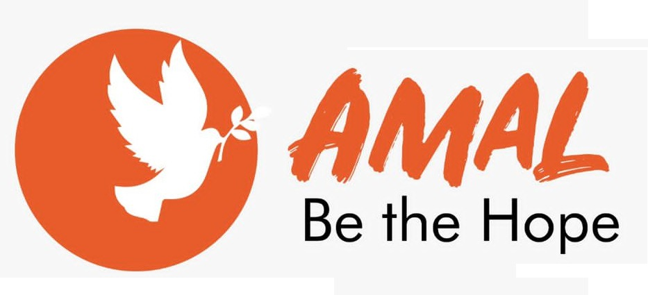

# Amal project

    Amal target is to connect the refugees to willing supporters who can offer a helping hand to address their problems so they meet their basic requirements.

  <p align="center">
    What inspired us was being a refugee due to the civil war that took place in April 2016 made me experience the hardship that refugees goes through for example waiting  every month for d food and few basic requirements which doesnt Surstaine refugees for the whole month, poor health centers,  low education systems. Hence i wouldn’t like any human being to go pass through the same the experience.
    <a href="https://inspirers.co">Website</a>
    ·
    <a href="https://github.com/Amalsouthsudan23/amal.git/issues">Issues</a>
    ·
    <a href="https://cal.com/roadmap">Roadmap</a>
  </p>
  
Help Create A World Where Refugees Can Live With Dignity.

## Getting Started

Before we install the project, Here is what you need to be able to run Inspirers:

- [Node.js (Version: >=16.x)](https://nodejs.org/en/download/)
- [Git Bash](https://git-scm.com/downloads)
- Browser (Chrome, Safari, Firefox, etc)
- NPM (comes bundled with Node.js)📦
- [NPM (recommended)](https://npm.com/getting-started/install) - a Node packaging manager 📦
- Code Editor ([VS Code](https://code.visualstudio.com/download), [Atom](https://flight-manual.atom.io/getting-started/sections/installing-atom/), [Vim](https://www.vim.org/download.php), [Bracket](http://brackets.io/), etc)

## Setup

1. Clone the project

```bash
    git clone git@github.com:Emmanuel-Melon/inspirers.git
```

2. Navigate to the project

```bash
    cd amal
```

3. Choose Node.js version and install dependencies

```bash
    nvm
```

### Database

Use [firebase](https://firebase.google.com/) .


